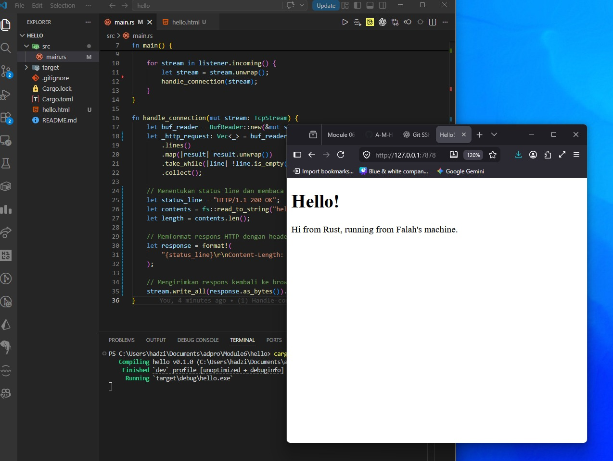
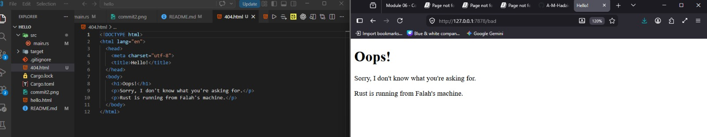

# Catatan Refleksi Commit 1

## Milestone 1: Server Web Single-Threaded

Pada Milestone 1, saya menerapkan server web single-threaded dasar yang dapat mendengarkan dan mencetak permintaan HTTP masuk.

### Komponen Utama

- **Setup Pendengar TCP**: Fungsi `TcpListener::bind` mendengarkan pada port tertentu (127.0.0.1:7878), sementara `listener.incoming()` menyediakan iterator atas upaya koneksi.

- **Penanganan Koneksi**: Di dalam fungsi `handle_connection`, saya menggunakan `BufReader` untuk membungkus `TcpStream`, yang memungkinkan pembacaan data masuk yang lebih efisien.

- **Parsing Permintaan**: Kode memanfaatkan pipeline iterasi fungsional—khususnya `lines()`, `map()`, dan `take_while()`—untuk mengekstrak baris permintaan hingga mencapai baris kosong yang menandakan akhir header HTTP. Proses ini secara efektif mengurai permintaan HTTP mentah menjadi kumpulan string yang dapat diperiksa di konsol.

### Hasil Pembelajaran

Mengumpulkan baris-baris ini ke dalam `Vec` dan mencetaknya membantu saya memvisualisasikan semua metadata yang dikirim browser saya ke server selama permintaan.

# Catatan Refleksi Commit 2

## Milestone 2: Mengirim File HTML sebagai Respons HTTP

Pada Milestone 2, saya mempelajari cara mengirimkan konten file HTML sebagai respons dari server web ke browser.

### Komponen Utama

- **Membaca File HTML**: Saya menggunakan fungsi `fs::read_to_string` untuk membaca isi file `hello.html` menjadi string yang kemudian dikirimkan ke klien.

- **Menyusun Respons HTTP**: Struktur respons HTTP harus mengikuti format yang tepat, yaitu _status line_ (`HTTP/1.1 200 OK`), header, dan body.

- **Header `Content-Length`**: Header ini penting untuk memberi tahu browser ukuran data (dalam byte) yang akan diterima. Jika nilainya tidak sesuai ukuran konten sebenarnya, browser bisa gagal menampilkan halaman dengan benar atau terus menunggu data tambahan.

- **Menggabungkan Respons dengan `format!`**: Dengan makro `format!`, saya menyatukan _status line_, header, dan isi file HTML menjadi satu string respons utuh sebelum dikirim melalui `stream.write_all`.

### Hasil Pembelajaran

Saya memahami bahwa ketepatan format respons HTTP sangat berpengaruh pada keberhasilan browser dalam merender halaman yang dikirim server.

### Dokumentasi Commit 2

# Catatan Refleksi Commit 3

## Milestone 3: Validasi Rute dan Penanganan 404

Pada Milestone 3, saya mengimplementasikan logika untuk memvalidasi permintaan HTTP masuk agar server dapat memberikan respons berbeda berdasarkan rute yang diminta.

### Komponen Utama

- **Validasi Request Line**: Saya membaca baris pertama permintaan (_request line_) dan memeriksa apakah rute valid, misalnya `GET / HTTP/1.1`, atau termasuk rute yang tidak terdaftar.

- **Respons untuk Rute Tidak Valid**: Jika rute tidak valid (misalnya `/bad`), server mengembalikan status `404 NOT FOUND` beserta konten dari file `404.html` yang menampilkan pesan kesalahan.

- **Refactoring Logika Respons**: Saya mengelompokkan penentuan `status line` dan nama file dalam satu blok logika (seperti `if/else` atau `match`), sehingga pembacaan file dan pengiriman respons cukup ditulis sekali di akhir fungsi.

### Hasil Pembelajaran

Refactoring pada tahap ini sangat penting agar kode tidak repetitif saat rute baru ditambahkan. Pendekatan ini membuat kode lebih bersih sesuai prinsip DRY (_Don't Repeat Yourself_) dan mempermudah pemeliharaan karena logika pemilihan rute dipisahkan dari logika penanganan file.

### Dokumentasi Commit 3

# Catatan Refleksi Commit 4

## Milestone 4: Simulasi Respons Lambat

Pada Milestone 4, saya mensimulasikan respons lambat pada server dengan menambahkan rute `/sleep` yang memanggil fungsi `thread::sleep` selama 10 detik.

### Komponen Utama

- **Rute `/sleep`**: Rute ini digunakan untuk mensimulasikan permintaan yang membutuhkan waktu proses lebih lama dari biasanya.

- **Dampak pada Server Single-Threaded**: Saat saya membuka dua jendela browser dan mengakses rute `/sleep` terlebih dahulu, lalu segera mengakses rute utama `/`, saya mengamati bahwa halaman utama tertahan sampai `/sleep` selesai diproses.

- **Penyebab Perilaku**: Hal ini terjadi karena server masih bersifat single-threaded, sehingga hanya dapat memproses satu permintaan dalam satu waktu secara sekuensial. Thread utama server sepenuhnya terpakai untuk menangani permintaan tidur tersebut, sehingga permintaan baru harus menunggu di antrean.

### Hasil Pembelajaran

Simulasi ini menunjukkan kelemahan besar server single-threaded dalam menangani trafik dunia nyata. Satu permintaan yang lambat dapat menyebabkan pengalaman buruk bagi pengguna lain, sehingga saya mendapat motivasi kuat untuk mengimplementasikan multithreading pada milestone berikutnya agar server dapat memproses banyak permintaan secara bersamaan tanpa saling memblokir.

# Catatan Refleksi Commit 5

## Milestone 5: Thread Pool dan Konkurensi

Pada Milestone 5, saya berhasil meningkatkan performa server dengan mengimplementasikan `ThreadPool` yang memungkinkan penanganan banyak permintaan secara konkuren.

### Komponen Utama

- **`mpsc` Channel**: Saya mempelajari bahwa penggunaan `mpsc` channel sangat penting untuk mengirimkan tugas (`Job`) dari thread utama ke sekumpulan worker thread yang siap mengeksekusinya.

- **Berbagi Receiver Secara Aman**: Untuk membagikan receiver channel di antara banyak worker secara aman, saya menggunakan kombinasi `Arc` untuk berbagi kepemilikan dan `Mutex` untuk memastikan hanya satu worker yang dapat mengambil tugas pada satu waktu.

- **Mengatasi Pemblokiran**: Implementasi ini menyelesaikan masalah pemblokiran pada Milestone 4. Rute lambat seperti `/sleep` tidak lagi menghalangi rute lainnya karena tugas tersebut dijalankan di thread yang berbeda.

- **Batas Jumlah Thread**: Penggunaan pool dengan jumlah thread terbatas, dalam hal ini 4, membantu mencegah serangan DoS yang dapat menghabiskan sumber daya sistem jika setiap koneksi dibiarkan membuat thread baru tanpa batas.

### Hasil Pembelajaran

Melalui proses ini, saya semakin memahami filosofi Rust dalam menangani konkurensi yang aman melalui sistem ownership dan type system yang mendeteksi potensi kesalahan sejak masa kompilasi.
